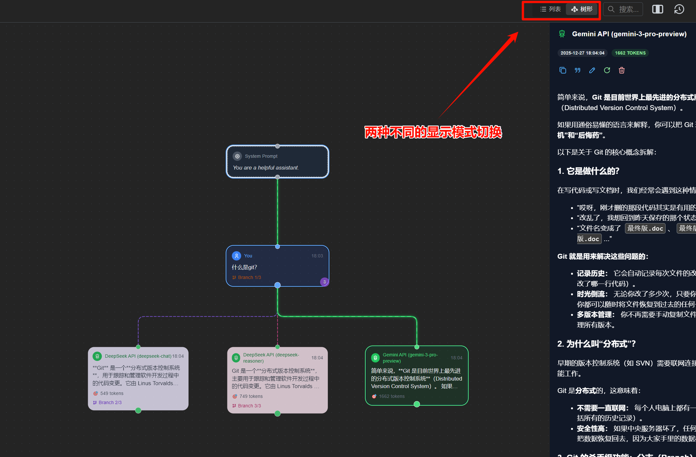
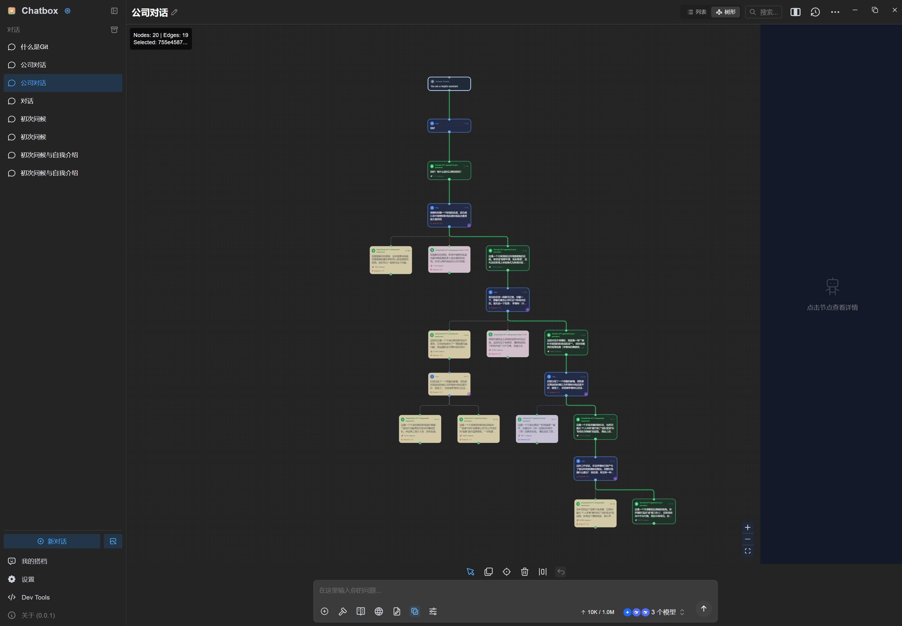
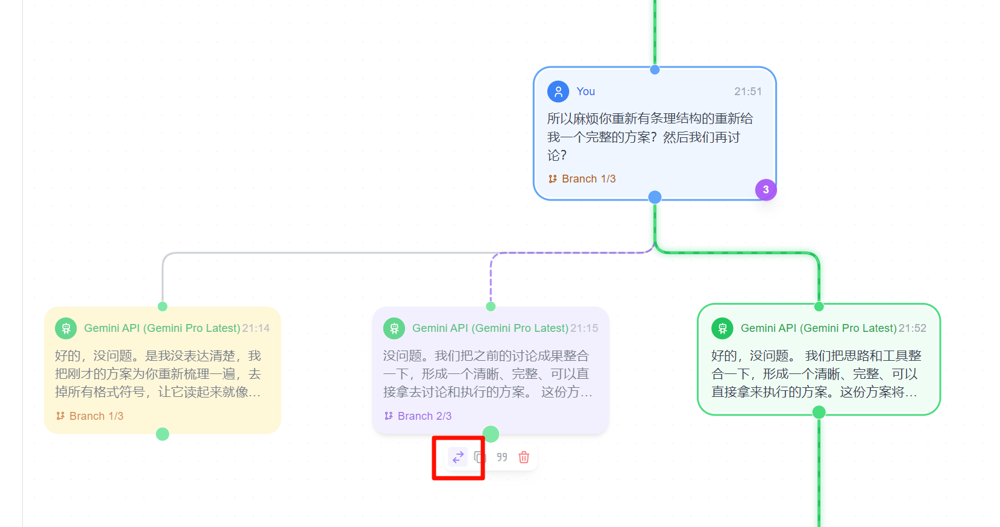
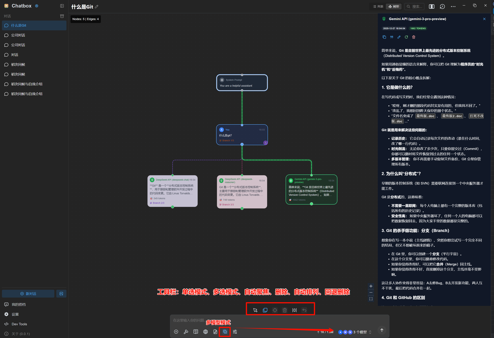
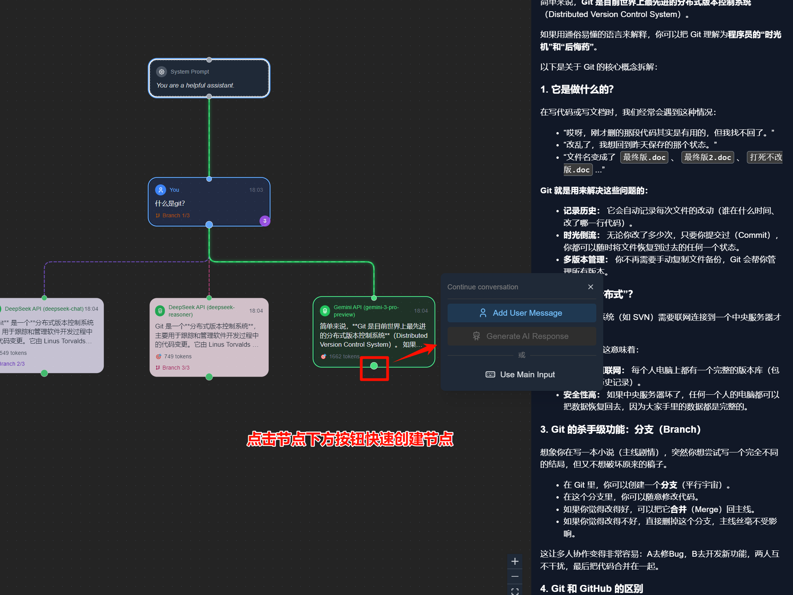

<p align="right">
  <a href="README.md">English</a> |
  <a href="./doc/README-CN.md">简体中文</a>
</p>

# Chatbox (Git-Style Tree Version)

This is the repository for the Chatbox Community Edition, open-sourced under the GPLv3 license.

[Chatbox is going open-source Again!](https://github.com/chatboxai/chatbox/issues/2266)

We regularly sync code from the pro repo to this repo, and vice versa.

> **⚠️ Disclaimer & Acknowledgements / 致敬与说明**
>
> This is a **community fork** based on the excellent work of [Chatbox](https://github.com/chatboxai/chatbox).
> This version introduces a **Git-Style Tree View** to help users visualize conversation branches, compare model outputs, and manage complex dialogue contexts.
>
> **Please support the original project!** This fork is intended as an auxiliary tool for specific needs. For the standard experience, please use the official [Chatbox](https://chatboxai.app).
>
> 本项目是 [Chatbox](https://github.com/chatboxai/chatbox) 的社区 Fork 版本。
> 我们在此版本中引入了 **Git 风格的树状视图**，旨在帮助用户可视化对话分支、对比不同模型的输出以及管理复杂的对话上下文。
> **请支持原项目！** 此分支仅作为特定需求下的辅助工具。如需标准体验，请访问官方 [Chatbox](https://chatboxai.app)。

---

## Tree Version Features (此版本特色)

### 1. Visualization Tree View (可视化节点视图)
Visualize your conversation flow like a Git graph. Every question and answer is a node.
像 Git 图谱一样可视化您的对话流。每个问答都是一个节点，清晰展示对话的上下文和分支结构。


> **Display Modes (显示模式)**
>
> Switch between different display modes to suit your needs.
> 切换不同的显示模式以适应您的需求。
>
> 

### 2. Branch Management (分支管理)
Easily create new branches from any node to try different prompts or compare responses.
轻松从任意节点创建新分支，尝试不同的提示词，或对比不同回答。



> **Seamless Switching (无缝切换)**
>
> Switch between branches effortlessly to explore different conversation paths.
> 轻松在不同分支间切换，探索不同的对话路径。
>
> 

### 3. Flexible Context (灵活上下文)
**Custom Reference (自由引用)**
Select specific nodes to include in the context, giving you full control over what the AI sees.
选择特定节点作为上下文，完全控制 AI 的输入内容。


### 4. Efficient Interaction (高效交互)
**Toolbar & Quick Actions (工具栏与快捷操作)**
Hover over nodes for quick actions (Edit, Copy, Quote, Delete), or use the toolbar for advanced controls.
悬浮节点进行编辑、复制、引用、删除等快捷操作，或使用工具栏进行高级控制。



**Quick Node Creation (快速创建节点)**
Quickly extend the conversation from any point.
从任意位置快速扩展对话。



- **Detail Panel**: Click any node to view full Markdown content in a resizeable side panel.
- **详情面板**: 点击节点在侧边栏查看完整的 Markdown 内容，支持宽度调整。

---

## Download

### Tree Version (下载 Tree 版)

| Platform | Download |
|----------|----------|
| Windows (x64) | [Chatbox Tree-1.18.1-Setup.exe](https://github.com/NTOM/chatbox_GraphVersion/releases/download/v1.18.1/Chatbox.Tree-1.18.1-Setup.exe) |
| macOS (Apple Silicon) | [Chatbox Tree-1.18.1-arm64.dmg](https://github.com/NTOM/chatbox_GraphVersion/releases/download/v1.18.1/Chatbox.Tree-1.18.1-arm64.dmg) |
| macOS (Intel) | [Chatbox Tree-1.18.1.dmg](https://github.com/NTOM/chatbox_GraphVersion/releases/download/v1.18.1/Chatbox.Tree-1.18.1.dmg) |

> **Installation Path / 安装路径**:
> - Windows: `C:\Program Files\Chatbox Tree`
> - macOS: `/Applications/Chatbox Tree.app`
>
> This version installs separately from the original Chatbox, so you can use both side-by-side.
> Compatible with chat history from the original Chatbox.
>
> 此版本与原版 Chatbox 独立安装，可同时使用。
> 兼容原版 Chatbox 的聊天记录。

### Chatbox Community Edition (Original / 原版下载)

<table style="width: 100%">
  <tr>
    <td width="25%" align="center">
      <b>Windows</b>
    </td>
    <td width="25%" align="center" colspan="2">
      <b>MacOS</b>
    </td>
    <td width="25%" align="center">
      <b>Linux</b>
    </td>
  </tr>
  <tr style="text-align: center">
    <td align="center" valign="middle">
      <a href='https://chatboxai.app/?c=download-windows'>
        
        <br />
        <b>Setup.exe</b>
      </a>
    </td>
    <td align="center" valign="middle">
      <a href='https://chatboxai.app/?c=download-mac-intel'>
        
        <br />
        <b>Intel</b>
      </a>
    </td>
    <td align="center" valign="middle">
      <a href='https://chatboxai.app/?c=download-mac-aarch'>
        
        <br />
        <b style="white-space: nowrap;">Apple Silicon</b>
      </a>
    </td>
    <td align="center" valign="middle">
      <a href='https://chatboxai.app/?c=download-linux'>
        
        <br />
        <b>AppImage</b>
      </a>
    </td>
  </tr>
</table>

<a href='https://apps.apple.com/app/chatbox-ai/id6471368056' style='margin-right: 4px'>

</a>
<a href='https://play.google.com/store/apps/details?id=xyz.chatboxapp.chatbox' style='margin-right: 4px'>

</a>
<a href='https://chatboxai.app/install?download=android_apk' style='margin-right: 4px; display: inline-flex; justify-content: center'>

.APK
</a>

For more information: [chatboxai.app](https://chatboxai.app/)

---

## Prerequisites

- Node.js (v20.x – v22.x)
- npm (required – pnpm is not supported)

## Build Instructions

1. Clone the repository from Github

```bash
git clone https://github.com/chatboxai/chatbox.git
```

2. Install the required dependencies

```bash
npm install
```

3. Start the application (in development mode)

```bash
npm run dev
```

4. Build the application, package the installer for current platform

```bash
npm run package
```

5. Build the application, package the installer for all platforms

```bash
npm run package:all
```

## License

[LICENSE](./LICENSE)
