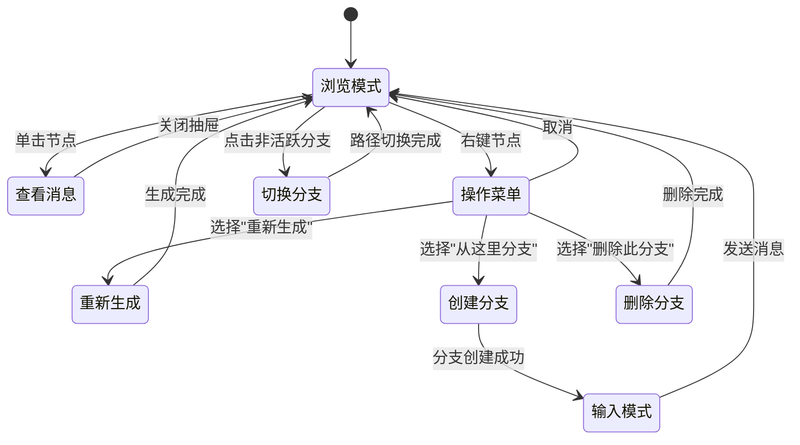

# 节点式对话系统开发规划

## 1. 项目目标

### 1.1 核心目标

构建一个**节点式对话可视化系统**，与现有的线性对话列表并存，用户可通过顶部按钮一键切换两种视图模式。

### 1.2 设计原则

- **数据统一**：节点视图与列表视图共享同一套数据结构（`Session`），无需数据迁移
- **双向同步**：在任一视图中的操作都能实时反映到另一视图
- **Git 风格布局**：采用垂直方向的分支图，类似 Git Graph 或 Houdini 节点树
- **渐进增强**：不破坏现有功能，作为增强功能叠加

### 1.3 预期效果

```
┌─────────────────────────────────────────────────────────────┐
│  [列表视图]  [节点视图]                              会话名称 │
├─────────────────────────────────────────────────────────────┤
│                                                             │
│                    ┌──────────┐                             │
│                    │ System   │                             │
│                    │ Prompt   │                             │
│                    └────┬─────┘                             │
│                         │                                   │
│                    ┌────▼─────┐                             │
│                    │ User Q1  │                             │
│                    └────┬─────┘                             │
│                         │                                   │
│                    ┌────▼─────┐                             │
│                    │ AI Ans1  │                             │
│                    └────┬─────┘                             │
│                    ┌────┴────┐                              │
│               ┌────▼───┐ ┌───▼────┐                         │
│               │User Q2A│ │User Q2B│  ← 分支点               │
│               └────┬───┘ └───┬────┘                         │
│               ┌────▼───┐ ┌───▼────┐                         │
│               │AI Ans2A│ │AI Ans2B│                         │
│               └────────┘ └────────┘                         │
│                    ▲                                        │
│                    └── 当前活跃分支高亮                       │
│                                                             │
├─────────────────────────────────────────────────────────────┤
│  [输入框]                                          [发送]   │
└─────────────────────────────────────────────────────────────┘
```

---

## 2. 架构对比

### 2.1 现有架构

```mermaid
graph TB
    subgraph DataLayer[数据层]
        Session[Session 会话数据]
        Messages[messages: Message[]]
        Threads[threads: SessionThread[]]
        Forks[messageForksHash: Record]
    end

    subgraph StoreLayer[状态管理层]
        ChatStore[chatStore]
        SessionActions[sessionActions]
    end

    subgraph ViewLayer[视图层]
        MessageList[MessageList 组件]
        Message[Message 组件]
        ForkNav[ForkNav 分支导航]
    end

    Session --> Messages
    Session --> Threads
    Session --> Forks

    ChatStore --> Session
    SessionActions --> ChatStore

    MessageList --> Message
    Message --> ForkNav
    ChatStore --> MessageList
```

### 2.2 新架构

```mermaid
graph TB
    subgraph DataLayer[数据层 - 保持不变]
        Session[Session 会话数据]
        Messages[messages: Message[]]
        Threads[threads: SessionThread[]]
        Forks[messageForksHash: Record]
    end

    subgraph StoreLayer[状态管理层]
        ChatStore[chatStore]
        SessionActions[sessionActions]
        TreeStore[conversationTreeStore<br/>新增：视图状态管理]
    end

    subgraph AdapterLayer[适配层 - 新增]
        TreeAdapter[TreeAdapter<br/>Session ↔ 树形结构转换]
    end

    subgraph ViewLayer[视图层]
        ViewSwitch[ViewModeSwitch<br/>视图切换按钮]
        
        subgraph ListView[列表视图 - 保持不变]
            MessageList[MessageList]
            Message[Message]
        end
        
        subgraph TreeView[节点视图 - 新增]
            ConversationTree[ConversationTreeView]
            TreeNodes[自定义节点组件]
            TreeEdges[自定义连线组件]
            TreeControls[控制面板]
        end
    end

    Session --> Messages
    Session --> Threads
    Session --> Forks

    ChatStore --> Session
    SessionActions --> ChatStore
    TreeStore --> TreeAdapter

    TreeAdapter --> Session
    TreeAdapter --> ConversationTree

    ViewSwitch --> ListView
    ViewSwitch --> TreeView

    ChatStore --> MessageList
    ChatStore --> ConversationTree
```

### 2.3 数据流对比


---

## 3. 技术栈概览

### 3.1 现有技术栈（保持）

| 类别 | 技术 | 用途 |
|------|------|------|
| 框架 | React 18 | UI 框架 |
| 状态管理 | Zustand + Jotai | 全局状态 |
| 数据查询 | TanStack Query | 缓存与同步 |
| UI 组件 | Mantine | 基础组件库 |
| 样式 | Tailwind CSS | 原子化样式 |
| 类型校验 | Zod | 运行时类型验证 |

### 3.2 新增技术栈

| 类别 | 技术 | 用途 | 选择理由 |
|------|------|------|----------|
| 节点编辑器 | **ReactFlow** | 节点图渲染与交互 | 成熟稳定、文档完善、支持自定义节点 |
| 布局算法 | **dagre** | 自动计算节点位置 | 轻量、支持垂直布局、与 ReactFlow 集成良好 |
| 动画 | **Framer Motion** | 节点动画效果 | 项目可能已有，或使用 Mantine 内置动画 |

### 3.3 技术架构图


---

## 4. 阶段计划

### 阶段总览


---

### 阶段一：基础设施搭建

#### 目标
建立节点视图的技术基础，实现数据适配层，完成视图切换框架。

#### 预期效果
- 顶部出现视图切换按钮
- 点击"节点视图"可切换到空白的 ReactFlow 画布
- 控制台可打印出转换后的树形数据结构

#### 涉及技术
- ReactFlow 安装与基础配置
- dagre 布局算法集成
- Session → ConversationTree 数据转换器
- 视图切换状态管理

#### 文件结构
```
src/renderer/
├── components/
│   └── conversation-tree/
│       ├── index.ts
│       └── ConversationTreeView.tsx    # 空白画布占位
├── lib/
│   ├── conversation-tree-adapter.ts    # 数据转换
│   └── tree-layout.ts                  # 布局算法
└── stores/
    └── viewModeStore.ts                # 视图模式状态
```

#### 核心数据结构
```typescript
// 树节点定义
interface TreeNode {
  id: string
  type: 'system' | 'user' | 'assistant'
  message: Message
  parentId: string | null
  childrenIds: string[]
  branchIndex?: number        // 在同级分支中的索引
  isActivePath: boolean       // 是否在当前活跃路径上
}

// 树结构
interface ConversationTree {
  nodes: Map<string, TreeNode>
  edges: Array<{ source: string; target: string }>
  rootId: string
  activeLeafId: string        // 当前活跃分支的叶子节点
}
```

---

### 阶段二：核心视图实现

#### 目标
实现完整的节点树可视化，包括自定义节点样式、连线样式和自动布局。

#### 预期效果
- 对话以垂直树形结构展示
- 不同角色的消息有不同的节点样式
- 分支点清晰可见，分支用不同颜色区分
- 当前活跃分支高亮显示
- 支持画布缩放、拖拽、小地图

#### 涉及技术
- ReactFlow 自定义节点（Custom Nodes）
- ReactFlow 自定义边（Custom Edges）
- dagre 垂直布局配置
- Tailwind 节点样式

#### 节点类型设计


#### 连线类型设计


---

### 阶段三：交互功能完善

#### 目标
实现节点视图中的所有交互操作，确保与列表视图功能对等。

#### 预期效果
- 点击节点可查看完整消息内容（侧边抽屉或弹窗）
- 右键节点显示操作菜单（重新生成、创建分支、删除等）
- 点击分支可切换当前活跃路径
- 从任意节点可发送新消息（自动创建分支或延续）
- 列表视图中的操作实时同步到节点视图

#### 涉及技术
- ReactFlow 事件处理（onNodeClick, onNodeContextMenu）
- Mantine Drawer/Modal 组件
- 现有 sessionActions 复用
- 双向数据同步机制

#### 交互流程


---

### 阶段四：体验优化与测试

#### 目标
优化用户体验，处理边界情况，确保稳定性。

#### 预期效果
- 大型对话树（100+节点）流畅渲染
- 切换视图时保持滚动位置/焦点
- 新消息生成时自动定位到新节点
- 分支操作有平滑动画
- 完善的键盘快捷键支持

#### 涉及技术
- ReactFlow 性能优化（节点虚拟化）
- 状态持久化（记住用户偏好的视图模式）
- 动画库集成
- 单元测试 & E2E 测试

#### 性能优化策略


---

## 5. 风险与应对

| 风险 | 影响 | 应对策略 |
|------|------|----------|
| ReactFlow 学习曲线 | 开发周期延长 | 先做最小可行版本，逐步迭代 |
| 大型对话性能问题 | 用户体验下降 | 早期引入虚拟化，设置节点数量预警 |
| 数据同步复杂度 | 数据不一致 | 单一数据源原则，所有操作走 sessionActions |
| 移动端适配 | 触摸交互困难 | 移动端默认使用列表视图，节点视图仅桌面端 |

---

## 6. 成功指标

- [ ] 视图切换响应时间 < 200ms
- [ ] 100 节点以下对话树渲染帧率 > 30fps
- [ ] 所有现有分支功能在节点视图中可用
- [ ] 两种视图数据完全同步，无不一致情况
- [ ] 用户无需学习即可理解节点视图的含义

---

## 附录：参考资料

- [ReactFlow 官方文档](https://reactflow.dev/)
- [dagre 布局算法](https://github.com/dagrejs/dagre)
- [Git Graph 可视化参考](https://github.com/mhutchie/vscode-git-graph)
- [Houdini 节点编辑器 UI 参考](https://www.sidefx.com/docs/houdini/network/index.html)
