# 节点式对话系统开发规划

## 1. 项目目标

### 1.1 核心目标

构建一个**节点式对话可视化系统**，与现有的线性对话列表并存，用户可通过顶部按钮一键切换两种视图模式。

### 1.2 设计原则

- **数据统一**：节点视图与列表视图共享同一套数据结构（`Session`），无需数据迁移
- **双向同步**：在任一视图中的操作都能实时反映到另一视图
- **Git 风格布局**：采用垂直方向的分支图，类似 Git Graph 或 Houdini 节点树
- **渐进增强**：不破坏现有功能，作为增强功能叠加

### 1.3 预期效果

```
┌─────────────────────────────────────────────────────────────┐
│  [列表视图]  [节点视图]                              会话名称 │
├─────────────────────────────────────────────────────────────┤
│                                                             │
│                    ┌──────────┐                             │
│                    │ System   │                             │
│                    │ Prompt   │                             │
│                    └────┬─────┘                             │
│                         │                                   │
│                    ┌────▼─────┐                             │
│                    │ User Q1  │                             │
│                    └────┬─────┘                             │
│                         │                                   │
│                    ┌────▼─────┐                             │
│                    │ AI Ans1  │                             │
│                    └────┬─────┘                             │
│                    ┌────┴────┐                              │
│               ┌────▼───┐ ┌───▼────┐                         │
│               │User Q2A│ │User Q2B│  ← 分支点               │
│               └────┬───┘ └───┬────┘                         │
│               ┌────▼───┐ ┌───▼────┐                         │
│               │AI Ans2A│ │AI Ans2B│                         │
│               └────────┘ └────────┘                         │
│                    ▲                                        │
│                    └── 当前活跃分支高亮                       │
│                                                             │
├─────────────────────────────────────────────────────────────┤
│  [输入框]                                          [发送]   │
└─────────────────────────────────────────────────────────────┘
```

---

## 2. 架构对比

### 2.1 现有架构

```mermaid
graph TB
    subgraph DataLayer[数据层]
        Session[Session 会话数据]
        Messages[messages: Message]
        Threads[threads: SessionThread]
        Forks[messageForksHash: Record]
    end

    subgraph StoreLayer[状态管理层]
        ChatStore[chatStore]
        SessionActions[sessionActions]
    end

    subgraph ViewLayer[视图层]
        MessageList[MessageList 组件]
        Message[Message 组件]
        ForkNav[ForkNav 分支导航]
    end

    Session --> Messages
    Session --> Threads
    Session --> Forks

    ChatStore --> Session
    SessionActions --> ChatStore

    MessageList --> Message
    Message --> ForkNav
    ChatStore --> MessageList
```



### 2.2 新架构

```mermaid
graph TB
    subgraph DataLayer[数据层 - 保持不变]
        Session[Session 会话数据]
        Messages[messages: Message]
        Threads[threads: SessionThread]
        Forks[messageForksHash: Record]
    end

    subgraph StoreLayer[状态管理层]
        ChatStore[chatStore]
        SessionActions[sessionActions]
        TreeStore[conversationTreeStore<br/>新增：视图状态管理]
    end

    subgraph AdapterLayer[适配层 - 新增]
        TreeAdapter[TreeAdapter<br/>Session ↔ 树形结构转换]
    end

    subgraph ViewLayer[视图层]
        ViewSwitch[ViewModeSwitch<br/>视图切换按钮]
        
        subgraph ListView[列表视图 - 保持不变]
            MessageList[MessageList]
            Message[Message]
        end
        
        subgraph TreeView[节点视图 - 新增]
            ConversationTree[ConversationTreeView]
            TreeNodes[自定义节点组件]
            TreeEdges[自定义连线组件]
            TreeControls[控制面板]
        end
    end

    Session --> Messages
    Session --> Threads
    Session --> Forks

    ChatStore --> Session
    SessionActions --> ChatStore
    TreeStore --> TreeAdapter

    TreeAdapter --> Session
    TreeAdapter --> ConversationTree

    ViewSwitch --> ListView
    ViewSwitch --> TreeView

    ChatStore --> MessageList
    ChatStore --> ConversationTree
```



### 2.3 数据流对比

```mermaid
sequenceDiagram
    participant User as 用户
    participant View as 视图层
    participant Adapter as 适配层
    participant Store as 状态管理
    participant Data as Session数据

    rect rgb(200, 230, 200)
        Note over User,Data: 列表视图操作流程（现有）
        User->>View: 发送消息
        View->>Store: insertMessage()
        Store->>Data: 更新 messages[]
        Data-->>View: 触发重渲染
    end

    rect rgb(200, 200, 230)
        Note over User,Data: 节点视图操作流程（新增）
        User->>View: 从节点发送消息
        View->>Adapter: 定位当前节点路径
        Adapter->>Store: insertMessage() / createNewFork()
        Store->>Data: 更新 messages[] / messageForksHash
        Data->>Adapter: 重新构建树结构
        Adapter-->>View: 更新节点和连线
    end
```



---

## 3. 技术栈概览

### 3.1 现有技术栈（保持）

| 类别 | 技术 | 用途 |
|------|------|------|
| 框架 | React 18 | UI 框架 |
| 状态管理 | Zustand + Jotai | 全局状态 |
| 数据查询 | TanStack Query | 缓存与同步 |
| UI 组件 | Mantine | 基础组件库 |
| 样式 | Tailwind CSS | 原子化样式 |
| 类型校验 | Zod | 运行时类型验证 |

### 3.2 新增技术栈

| 类别 | 技术 | 用途 | 选择理由 |
|------|------|------|----------|
| 节点编辑器 | **ReactFlow** | 节点图渲染与交互 | 成熟稳定、文档完善、支持自定义节点 |
| 布局算法 | **dagre** | 自动计算节点位置 | 轻量、支持垂直布局、与 ReactFlow 集成良好 |
| 动画 | **Framer Motion** | 节点动画效果 | 项目可能已有，或使用 Mantine 内置动画 |

### 3.3 技术架构图

```mermaid
graph LR
    subgraph Frontend[前端技术栈]
        React[React 18]
        
        subgraph State[状态管理]
            Zustand
            Jotai
            TanStack[TanStack Query]
        end
        
        subgraph UI[UI层]
            Mantine
            Tailwind
            ReactFlow[ReactFlow<br/>新增]
        end
        
        subgraph Utils[工具层]
            Zod
            Dagre[Dagre<br/>新增]
        end
    end

    React --> State
    React --> UI
    State --> Utils
```



---

## 4. 阶段计划

### 阶段总览

```mermaid
gantt
    title 节点式对话系统开发路线图
    dateFormat  YYYY-MM-DD
    section 阶段一
    基础设施搭建           :a1, 2024-01-01, 7d
    section 阶段二
    核心视图实现           :a2, after a1, 10d
    section 阶段三
    交互功能完善           :a3, after a2, 10d
    section 阶段四
    体验优化与测试         :a4, after a3, 7d
```



---

### 阶段一：基础设施搭建 

✅ 已完成

#### 目标
建立节点视图的技术基础，实现数据适配层，完成视图切换框架。

#### 预期效果
- ✅ 顶部出现视图切换按钮
- ✅ 点击"节点视图"可切换到 ReactFlow 画布
- ✅ 控制台可打印出转换后的树形数据结构
- ✅ 基础节点渲染（System/User/Assistant 三种类型）

#### 涉及技术
- ✅ ReactFlow (@xyflow/react) 安装与基础配置
- ✅ dagre 布局算法集成
- ✅ Session → ConversationTree 数据转换器
- ✅ 视图切换状态管理

#### 已创建文件
```
src/renderer/
├── components/
│   └── conversation-tree/
│       ├── index.ts                        # 组件导出
│       ├── ConversationTreeView.tsx        # 主视图组件
│       ├── ViewModeSwitch.tsx              # 视图切换按钮
│       └── nodes/
│           ├── index.ts                    # 节点导出
│           ├── SystemNode.tsx              # 系统提示节点
│           ├── UserNode.tsx                # 用户消息节点
│           └── AssistantNode.tsx           # AI回复节点
├── lib/
│   ├── conversation-tree-adapter.ts        # Session → Tree 数据转换
│   └── tree-layout.ts                      # dagre 布局算法封装
└── stores/
    └── viewModeStore.ts                    # 视图模式状态管理

修改的文件:
- src/renderer/components/Header.tsx        # 添加视图切换按钮
- src/renderer/routes/session/$sessionId.tsx # 根据视图模式切换显示
- src/renderer/i18n/locales/en/translation.json  # 英文翻译
- src/renderer/i18n/locales/zh-Hans/translation.json # 中文翻译
```

#### 核心数据结构
```typescript
// 树节点定义
interface TreeNode {
  id: string
  type: 'system' | 'user' | 'assistant'
  message: Message
  parentId: string | null
  childrenIds: string[]
  branchIndex?: number        // 在同级分支中的索引
  isActivePath: boolean       // 是否在当前活跃路径上
}

// 树结构
interface ConversationTree {
  nodes: Map<string, TreeNode>
  edges: Array<{ source: string; target: string }>
  rootId: string
  activeLeafId: string        // 当前活跃分支的叶子节点
}
```

---

### 阶段二：核心视图实现

✅ 已完成

#### 目标
实现完整的节点树可视化，包括自定义节点样式、连线样式和自动布局。

#### 预期效果
- ✅ 对话以垂直树形结构展示
- ✅ 不同角色的消息有不同的节点样式
- ✅ 分支点清晰可见，分支用不同颜色区分
- ✅ 当前活跃分支高亮显示
- ✅ 支持画布缩放、拖拽、小地图

#### 涉及技术
- ✅ ReactFlow 自定义节点（Custom Nodes）
- ✅ ReactFlow 自定义边（Custom Edges）
- ✅ dagre 垂直布局配置
- ✅ Tailwind 节点样式

#### 已创建/修改文件
```
src/renderer/components/conversation-tree/
├── edges/                          # 自定义边组件（新增）
│   ├── index.ts                    # 边组件导出
│   ├── ActivePathEdge.tsx          # 活跃路径边（绿色发光+流动动画）
│   ├── BranchEdge.tsx              # 分支边（彩色虚线）
│   └── DefaultEdge.tsx             # 默认边（灰色）
├── utils/                          # 工具函数（新增）
│   ├── index.ts                    # 工具导出
│   └── branchColors.ts             # 分支颜色系统（8色调色板）
├── nodes/
│   ├── UserNode.tsx                # 更新：添加分支颜色指示
│   └── AssistantNode.tsx           # 更新：添加分支颜色+子分支指示器
├── ConversationTreeView.tsx        # 更新：集成自定义边类型
└── index.ts                        # 更新：导出边类型

src/renderer/lib/
└── conversation-tree-adapter.ts    # 更新：边数据增加branchIndex
```

#### 节点类型设计

```mermaid
graph TB
    subgraph NodeTypes[节点类型]
        SystemNode[SystemNode<br/>系统提示节点<br/>灰色/虚线边框]
        UserNode[UserNode<br/>用户消息节点<br/>蓝色主题]
        AssistantNode[AssistantNode<br/>AI回复节点<br/>绿色主题]
        BranchIndicator[BranchIndicator<br/>分支指示器<br/>显示分支数量]
    end
```


#### 连线类型设计

```mermaid
graph TB
    subgraph EdgeTypes[连线类型]
        MainEdge[MainEdge<br/>主路径连线<br/>实线/较粗]
        BranchEdge[BranchEdge<br/>分支连线<br/>虚线/带颜色]
        ActiveEdge[ActiveEdge<br/>活跃路径<br/>高亮/动画]
    end
```


---

### 阶段三：交互功能完善

🔄 **进行中**

#### 目标
实现节点视图中的所有交互操作，确保与列表视图功能对等。

#### 任务清单

| # | 任务 | 状态 | 依赖 |
|---|------|------|------|
| 3.1 | 消息详情抽屉组件 | ✅ 已完成 | - |
| 3.2 | 节点悬浮操作按钮栏 | ✅ 已完成 | - |
| 3.3 | 文本选中引用功能 | ✅ 已完成 | 3.1 |
| 3.4 | Output Handle 创建面板（就地输入） | ✅ 已完成 | - |
| 3.5 | 底部输入框增强（目标节点选择器） | ✅ 已完成 | 3.4 |
| 3.6 | 集成测试 | ⬜ 待开始 | 3.1-3.5 |

#### 预期效果
- ✅ 点击节点可查看完整消息内容（右侧抽屉）
- ✅ 鼠标悬浮节点显示底部操作按钮栏
- ✅ 在抽屉中选中文字后可引用到新消息
- ✅ 点击节点底部 Output Handle 可创建新节点
- ✅ 底部输入框支持指定目标节点
- ✅ 列表视图中的操作实时同步到节点视图
- ✅ 树图也支持逐渐出字的效果
- ✅ 在不是当前分支的情况下，鼠标悬浮时候要增加一个新的按钮，用于切换到该分支


#### 问题
- ✅ 非当前分支的切换分支按钮无效，我认为必须有效
- ✅ 新建user的浮窗出现后，输入发送，应该自动也接着生成一个AI节点进行回答才合理
- ⬜ 当前节点下方的那个悬浮界面，鼠标移动过去的时候因为浮窗和节点之间有画板空隙，所以浮窗容易消失
- ✅ 新建一个AI Response节点有错误：

#### 已创建文件
```
src/renderer/components/conversation-tree/
├── MessageDetailDrawer.tsx        # ✅ 消息详情抽屉
├── TextSelectionQuote.tsx         # ✅ 文本选中引用组件
├── NodeActionBar.tsx              # ✅ 节点悬浮操作按钮栏
├── NodeCreatePopover.tsx          # ✅ Output Handle 创建面板
└── TargetNodeSelector.tsx         # ✅ 目标节点选择器
```

#### 详细功能设计

##### 3.1 消息详情抽屉
- **触发方式**：单击节点
- **位置**：右侧滑出抽屉
- **内容**：完整消息内容（Markdown 渲染）、消息元信息（时间、Token 用量等）
- **组件**：`MessageDetailDrawer.tsx`

##### 3.2 节点悬浮操作按钮栏
- **触发方式**：鼠标悬浮节点
- **位置**：节点底部
- **User 节点按钮**：编辑、复制、引用、删除
- **Assistant 节点按钮**：重新生成、复制、引用、删除
- **组件**：`NodeActionBar.tsx`

##### 3.3 文本选中引用功能
- **触发方式**：在抽屉中选中文字
- **交互**：选中后出现浮窗"引用"按钮
- **效果**：点击后在当前活跃分支末尾创建 User 节点，附上引用内容
- **组件**：`TextSelectionQuote.tsx`

##### 3.4 Output Handle 创建面板
- **触发方式**：点击节点底部的 Output Handle（连接点）
- **交互**：弹出 Popover 创建面板
- **支持创建**：
  - **User 节点**：显示简易输入框，支持就地输入
  - **Assistant 节点**：仅当前节点为 User 时可用，直接触发 AI 生成
- **分支逻辑**：
  - 从叶子节点创建 → 延续当前分支
  - 从中间节点创建 → 自动创建新分支
- **组件**：`NodeCreatePopover.tsx`

##### 3.5 底部输入框增强
- **新增功能**：目标节点选择器
- **交互**：可指定从哪个节点后创建新消息
- **默认行为**：当前活跃分支末尾
- **与 3.4 联动**：从 Output Handle 创建时可选择使用底部输入框

#### 涉及技术
- ReactFlow 事件处理（onNodeClick, onNodeContextMenu）
- Mantine Drawer/Popover/Menu 组件
- 现有 sessionActions 复用
- 文本选择 API（Selection API）
- 双向数据同步机制

#### 计划创建文件
```
src/renderer/components/conversation-tree/
├── MessageDetailDrawer.tsx        # 消息详情抽屉
├── NodeActionBar.tsx              # 节点悬浮操作按钮栏
├── TextSelectionQuote.tsx         # 文本选中引用组件
├── NodeCreatePopover.tsx          # Output Handle 创建面板
└── TargetNodeSelector.tsx         # 目标节点选择器（底部输入框增强）
```

#### 交互流程

```mermaid
stateDiagram-v2
    [*] --> 浏览模式
    
    浏览模式 --> 查看消息: 单击节点
    浏览模式 --> 操作菜单: 右键节点
    浏览模式 --> 切换分支: 点击非活跃分支
    浏览模式 --> 创建节点: 点击 Output Handle
    
    查看消息 --> 浏览模式: 关闭抽屉
    查看消息 --> 引用文本: 选中文字点击引用
    
    引用文本 --> 浏览模式: 创建引用消息
    
    操作菜单 --> 重新生成: 选择"重新生成"
    操作菜单 --> 创建分支: 选择"从这里分支"
    操作菜单 --> 删除分支: 选择"删除此分支"
    操作菜单 --> 浏览模式: 取消
    
    重新生成 --> 浏览模式: 生成完成
    创建分支 --> 输入模式: 分支创建成功
    删除分支 --> 浏览模式: 删除完成
    
    切换分支 --> 浏览模式: 路径切换完成
    
    创建节点 --> 就地输入: 选择创建 User 节点
    创建节点 --> AI生成: 选择创建 Assistant 节点
    创建节点 --> 底部输入框: 选择使用底部输入框
    
    就地输入 --> 浏览模式: 发送消息
    AI生成 --> 浏览模式: 生成完成
    底部输入框 --> 浏览模式: 发送消息
    
    输入模式 --> 浏览模式: 发送消息
```


---

### 阶段四：体验优化与测试

#### 目标
优化用户体验，处理边界情况，确保稳定性。

#### 预期效果
- 大型对话树（100+节点）流畅渲染
- 增加优秀的库来提升外观
- 主题变为黑色的时候，一些菜单要适配

#### 涉及技术
- ReactFlow 性能优化（节点虚拟化）
- 状态持久化（记住用户偏好的视图模式）
- 动画库集成
- 单元测试 & E2E 测试

#### 性能优化策略

```mermaid
graph TB
    subgraph Optimizations[性能优化]
        Virtualization[节点虚拟化<br/>只渲染可视区域]
        LazyContent[内容懒加载<br/>节点内容按需加载]
        MemoizedNodes[节点记忆化<br/>React.memo优化]
        BatchUpdates[批量更新<br/>合并状态变更]
    end
```


---

## 5. 风险与应对

| 风险 | 影响 | 应对策略 |
|------|------|----------|
| ReactFlow 学习曲线 | 开发周期延长 | 先做最小可行版本，逐步迭代 |
| 大型对话性能问题 | 用户体验下降 | 早期引入虚拟化，设置节点数量预警 |
| 数据同步复杂度 | 数据不一致 | 单一数据源原则，所有操作走 sessionActions |
| 移动端适配 | 触摸交互困难 | 移动端默认使用列表视图，节点视图仅桌面端 |

---

## 6. 成功指标

- [ ] 视图切换响应时间 < 200ms
- [ ] 100 节点以下对话树渲染帧率 > 30fps
- [ ] 所有现有分支功能在节点视图中可用
- [ ] 两种视图数据完全同步，无不一致情况
- [ ] 用户无需学习即可理解节点视图的含义

---

## 附录：参考资料

- [ReactFlow 官方文档](https://reactflow.dev/)
- [dagre 布局算法](https://github.com/dagrejs/dagre)
- [Git Graph 可视化参考](https://github.com/mhutchie/vscode-git-graph)
- [Houdini 节点编辑器 UI 参考](https://www.sidefx.com/docs/houdini/network/index.html)
