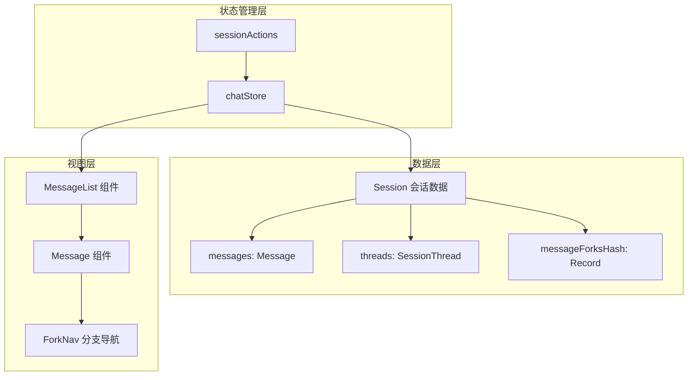
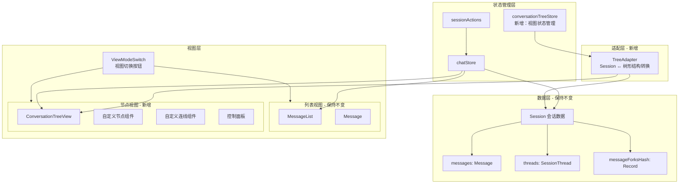
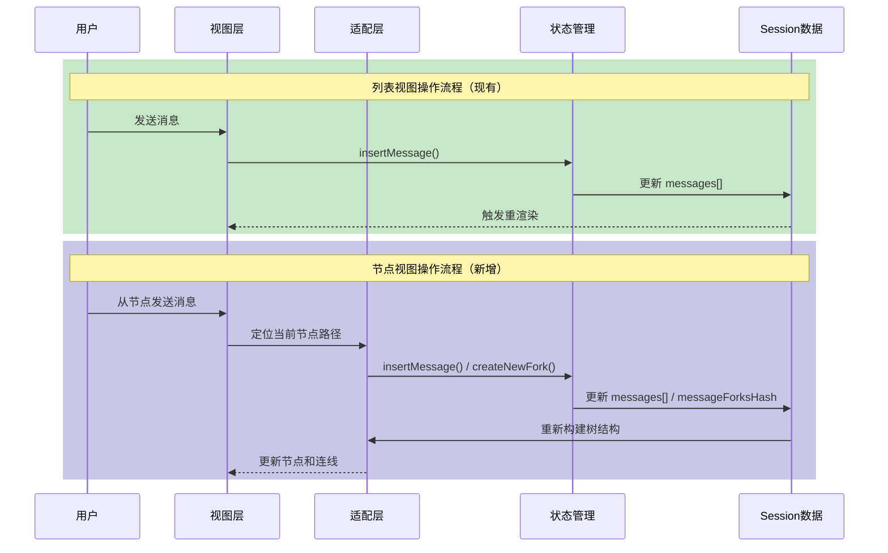
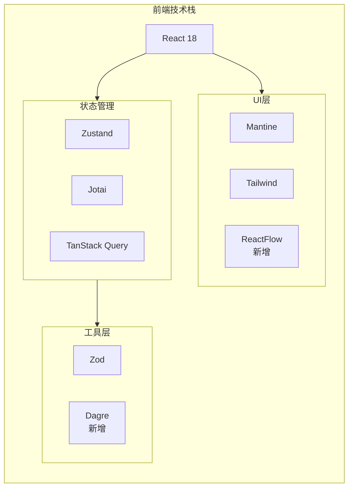
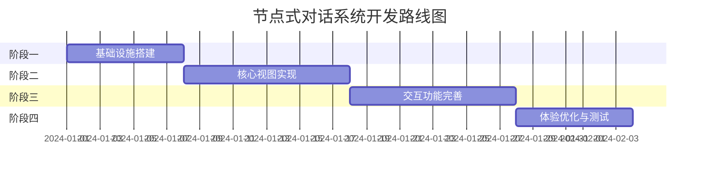
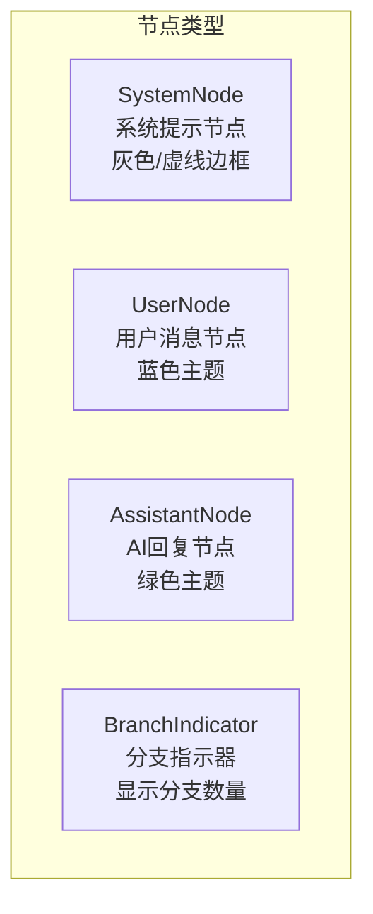
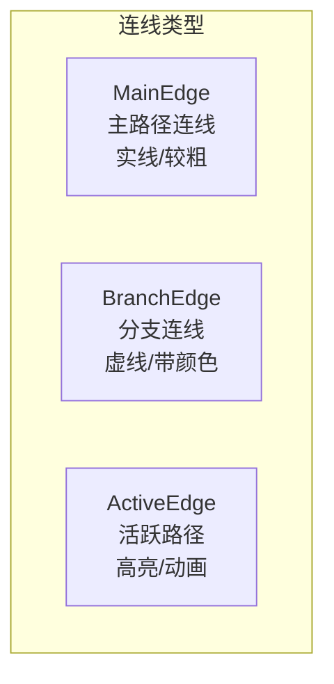
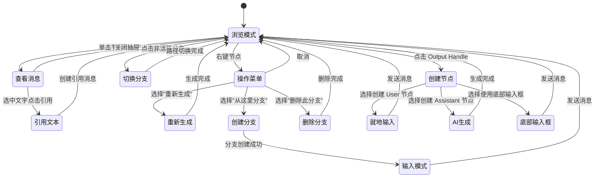
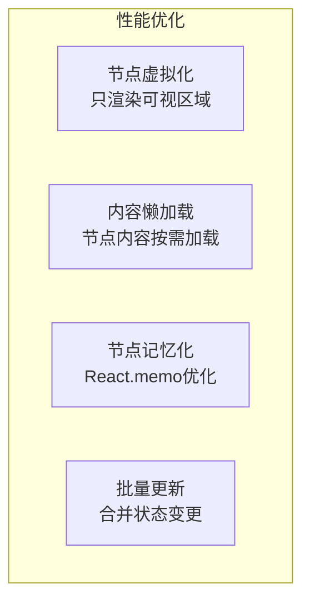

# 节点式对话系统开发规划

## 1. 项目目标

### 1.1 核心目标

构建一个**节点式对话可视化系统**，与现有的线性对话列表并存，用户可通过顶部按钮一键切换两种视图模式。

### 1.2 设计原则

- **数据统一**：节点视图与列表视图共享同一套数据结构（`Session`），无需数据迁移
- **双向同步**：在任一视图中的操作都能实时反映到另一视图
- **Git 风格布局**：采用垂直方向的分支图，类似 Git Graph 或 Houdini 节点树
- **渐进增强**：不破坏现有功能，作为增强功能叠加

### 1.3 预期效果

```
┌─────────────────────────────────────────────────────────────┐
│  [列表视图]  [节点视图]                              会话名称 │
├─────────────────────────────────────────────────────────────┤
│                                                             │
│                    ┌──────────┐                             │
│                    │ System   │                             │
│                    │ Prompt   │                             │
│                    └────┬─────┘                             │
│                         │                                   │
│                    ┌────▼─────┐                             │
│                    │ User Q1  │                             │
│                    └────┬─────┘                             │
│                         │                                   │
│                    ┌────▼─────┐                             │
│                    │ AI Ans1  │                             │
│                    └────┬─────┘                             │
│                    ┌────┴────┐                              │
│               ┌────▼───┐ ┌───▼────┐                         │
│               │User Q2A│ │User Q2B│  ← 分支点               │
│               └────┬───┘ └───┬────┘                         │
│               ┌────▼───┐ ┌───▼────┐                         │
│               │AI Ans2A│ │AI Ans2B│                         │
│               └────────┘ └────────┘                         │
│                    ▲                                        │
│                    └── 当前活跃分支高亮                       │
│                                                             │
├─────────────────────────────────────────────────────────────┤
│  [输入框]                                          [发送]   │
└─────────────────────────────────────────────────────────────┘
```

---

## 2. 架构对比

### 2.1 现有架构



### 2.2 新架构



### 2.3 数据流对比



---

## 3. 技术栈概览

### 3.1 现有技术栈（保持）

| 类别 | 技术 | 用途 |
|------|------|------|
| 框架 | React 18 | UI 框架 |
| 状态管理 | Zustand + Jotai | 全局状态 |
| 数据查询 | TanStack Query | 缓存与同步 |
| UI 组件 | Mantine | 基础组件库 |
| 样式 | Tailwind CSS | 原子化样式 |
| 类型校验 | Zod | 运行时类型验证 |

### 3.2 新增技术栈

| 类别 | 技术 | 用途 | 选择理由 |
|------|------|------|----------|
| 节点编辑器 | **ReactFlow** | 节点图渲染与交互 | 成熟稳定、文档完善、支持自定义节点 |
| 布局算法 | **dagre** | 自动计算节点位置 | 轻量、支持垂直布局、与 ReactFlow 集成良好 |
| 动画 | **Framer Motion** | 节点动画效果 | 项目可能已有，或使用 Mantine 内置动画 |

### 3.3 技术架构图



---

## 4. 阶段计划

### 阶段总览



---

### 阶段一：基础设施搭建 

✅ 已完成

#### 目标
建立节点视图的技术基础，实现数据适配层，完成视图切换框架。

#### 预期效果
- ✅ 顶部出现视图切换按钮
- ✅ 点击"节点视图"可切换到 ReactFlow 画布
- ✅ 控制台可打印出转换后的树形数据结构
- ✅ 基础节点渲染（System/User/Assistant 三种类型）

#### 涉及技术
- ✅ ReactFlow (@xyflow/react) 安装与基础配置
- ✅ dagre 布局算法集成
- ✅ Session → ConversationTree 数据转换器
- ✅ 视图切换状态管理

#### 已创建文件
```
src/renderer/
├── components/
│   └── conversation-tree/
│       ├── index.ts                        # 组件导出
│       ├── ConversationTreeView.tsx        # 主视图组件
│       ├── ViewModeSwitch.tsx              # 视图切换按钮
│       └── nodes/
│           ├── index.ts                    # 节点导出
│           ├── SystemNode.tsx              # 系统提示节点
│           ├── UserNode.tsx                # 用户消息节点
│           └── AssistantNode.tsx           # AI回复节点
├── lib/
│   ├── conversation-tree-adapter.ts        # Session → Tree 数据转换
│   └── tree-layout.ts                      # dagre 布局算法封装
└── stores/
    └── viewModeStore.ts                    # 视图模式状态管理

修改的文件:
- src/renderer/components/Header.tsx        # 添加视图切换按钮
- src/renderer/routes/session/$sessionId.tsx # 根据视图模式切换显示
- src/renderer/i18n/locales/en/translation.json  # 英文翻译
- src/renderer/i18n/locales/zh-Hans/translation.json # 中文翻译
```

#### 核心数据结构
```typescript
// 树节点定义
interface TreeNode {
  id: string
  type: 'system' | 'user' | 'assistant'
  message: Message
  parentId: string | null
  childrenIds: string[]
  branchIndex?: number        // 在同级分支中的索引
  isActivePath: boolean       // 是否在当前活跃路径上
}

// 树结构
interface ConversationTree {
  nodes: Map<string, TreeNode>
  edges: Array<{ source: string; target: string }>
  rootId: string
  activeLeafId: string        // 当前活跃分支的叶子节点
}
```

---

### 阶段二：核心视图实现

✅ 已完成

#### 目标
实现完整的节点树可视化，包括自定义节点样式、连线样式和自动布局。

#### 预期效果
- ✅ 对话以垂直树形结构展示
- ✅ 不同角色的消息有不同的节点样式
- ✅ 分支点清晰可见，分支用不同颜色区分
- ✅ 当前活跃分支高亮显示
- ✅ 支持画布缩放、拖拽、小地图

#### 涉及技术
- ✅ ReactFlow 自定义节点（Custom Nodes）
- ✅ ReactFlow 自定义边（Custom Edges）
- ✅ dagre 垂直布局配置
- ✅ Tailwind 节点样式

#### 已创建/修改文件
```
src/renderer/components/conversation-tree/
├── edges/                          # 自定义边组件（新增）
│   ├── index.ts                    # 边组件导出
│   ├── ActivePathEdge.tsx          # 活跃路径边（绿色发光+流动动画）
│   ├── BranchEdge.tsx              # 分支边（彩色虚线）
│   └── DefaultEdge.tsx             # 默认边（灰色）
├── utils/                          # 工具函数（新增）
│   ├── index.ts                    # 工具导出
│   └── branchColors.ts             # 分支颜色系统（8色调色板）
├── nodes/
│   ├── UserNode.tsx                # 更新：添加分支颜色指示
│   └── AssistantNode.tsx           # 更新：添加分支颜色+子分支指示器
├── ConversationTreeView.tsx        # 更新：集成自定义边类型
└── index.ts                        # 更新：导出边类型

src/renderer/lib/
└── conversation-tree-adapter.ts    # 更新：边数据增加branchIndex
```

#### 节点类型设计


#### 连线类型设计


---

### 阶段三：交互功能完善

🔄 **进行中**

#### 目标
实现节点视图中的所有交互操作，确保与列表视图功能对等。

#### 任务清单

| # | 任务 | 状态 | 依赖 |
|---|------|------|------|
| 3.1 | 消息详情抽屉组件 | ✅ 已完成 | - |
| 3.2 | 节点悬浮操作按钮栏 | ✅ 已完成 | - |
| 3.3 | 文本选中引用功能 | ✅ 已完成 | 3.1 |
| 3.4 | Output Handle 创建面板（就地输入） | ✅ 已完成 | - |
| 3.5 | 底部输入框增强（目标节点选择器） | ✅ 已完成 | 3.4 |
| 3.6 | 集成测试 | ⬜ 待开始 | 3.1-3.5 |

#### 预期效果
- ✅ 点击节点可查看完整消息内容（右侧抽屉）
- ✅ 鼠标悬浮节点显示底部操作按钮栏
- ✅ 在抽屉中选中文字后可引用到新消息
- ✅ 点击节点底部 Output Handle 可创建新节点
- ✅ 底部输入框支持指定目标节点
- ✅ 列表视图中的操作实时同步到节点视图
- ✅ 树图也支持逐渐出字的效果
- ✅ 在不是当前分支的情况下，鼠标悬浮时候要增加一个新的按钮，用于切换到该分支


#### 问题
- ✅ 非当前分支的切换分支按钮无效，我认为必须有效
- ✅ 新建user的浮窗出现后，输入发送，应该自动也接着生成一个AI节点进行回答才合理
- ✅ 当前节点下方的那个悬浮界面，鼠标移动过去的时候因为浮窗和节点之间有画板空隙，所以浮窗容易消失
- ✅ 新建一个AI Response节点有错误：
- ✅ 一旦激活一个分支，现在会自动将其放在最右边，但我认为不用进行位置排列。
- ✅ 点击下面的圆点新建节点的时候，出现了悬浮窗，然后此时如果移动画布，悬浮窗没有跟着移动
- ✅ 切回列表再切回树形的时候，树形中的节点位置全都变了，没有保存
- ✅ 当在偏左侧的分支下新建节点继续对话的时候，新节点的位置不是在原有的下方，而是会跑到其他位置，我希望我们新建节点的位置都是在我们点击那个圆按钮的那个节点的下方一定距离处，这样算是最基本的排列方式了。

#### 已创建文件
```
src/renderer/components/conversation-tree/
├── MessageDetailDrawer.tsx        # ✅ 消息详情抽屉
├── TextSelectionQuote.tsx         # ✅ 文本选中引用组件
├── NodeActionBar.tsx              # ✅ 节点悬浮操作按钮栏
├── NodeCreatePopover.tsx          # ✅ Output Handle 创建面板
└── TargetNodeSelector.tsx         # ✅ 目标节点选择器
```

#### 详细功能设计

##### 3.1 消息详情抽屉
- **触发方式**：单击节点
- **位置**：右侧滑出抽屉
- **内容**：完整消息内容（Markdown 渲染）、消息元信息（时间、Token 用量等）
- **组件**：`MessageDetailDrawer.tsx`

##### 3.2 节点悬浮操作按钮栏
- **触发方式**：鼠标悬浮节点
- **位置**：节点底部
- **User 节点按钮**：编辑、复制、引用、删除
- **Assistant 节点按钮**：重新生成、复制、引用、删除
- **组件**：`NodeActionBar.tsx`

##### 3.3 文本选中引用功能
- **触发方式**：在抽屉中选中文字
- **交互**：选中后出现浮窗"引用"按钮
- **效果**：点击后在当前活跃分支末尾创建 User 节点，附上引用内容
- **组件**：`TextSelectionQuote.tsx`

##### 3.4 Output Handle 创建面板
- **触发方式**：点击节点底部的 Output Handle（连接点）
- **交互**：弹出 Popover 创建面板
- **支持创建**：
  - **User 节点**：显示简易输入框，支持就地输入
  - **Assistant 节点**：仅当前节点为 User 时可用，直接触发 AI 生成
- **分支逻辑**：
  - 从叶子节点创建 → 延续当前分支
  - 从中间节点创建 → 自动创建新分支
- **组件**：`NodeCreatePopover.tsx`

##### 3.5 底部输入框增强
- **新增功能**：目标节点选择器
- **交互**：可指定从哪个节点后创建新消息
- **默认行为**：当前活跃分支末尾
- **与 3.4 联动**：从 Output Handle 创建时可选择使用底部输入框

#### 涉及技术
- ReactFlow 事件处理（onNodeClick, onNodeContextMenu）
- Mantine Drawer/Popover/Menu 组件
- 现有 sessionActions 复用
- 文本选择 API（Selection API）
- 双向数据同步机制

#### 计划创建文件
```
src/renderer/components/conversation-tree/
├── MessageDetailDrawer.tsx        # 消息详情抽屉
├── NodeActionBar.tsx              # 节点悬浮操作按钮栏
├── TextSelectionQuote.tsx         # 文本选中引用组件
├── NodeCreatePopover.tsx          # Output Handle 创建面板
└── TargetNodeSelector.tsx         # 目标节点选择器（底部输入框增强）
```

#### 交互流程


---

### 阶段四：体验优化与测试

🔄 **进行中**

#### 目标
优化用户体验，处理边界情况，确保稳定性。

#### 任务清单

| # | 任务 | 状态 | 说明 |
|---|------|------|------|
| 4.1 | 夜间模式适配 | ✅ 已完成 | MiniMap、Controls、Background、节点文字颜色 |
| 4.2 | 大型对话树性能优化 | ⬜ 待开始 | 100+节点流畅渲染 |
| 4.3 | 界面工具增强 | ✅ 已完成 | 框选、重排、侧边列表等 |
| 4.4 | 单元测试 & E2E 测试 | ⬜ 待开始 | - |

#### 已完成：夜间模式适配 (4.1)

修改的文件：
- `ConversationTreeView.tsx`：
  - MiniMap 背景色适配（明亮：`bg-gray-100`，夜间：`bg-gray-800`）
  - Controls 按钮背景色和图标颜色适配
  - Background 点阵颜色适配（明亮：`#e5e7eb`，夜间：`#4b5563`）
  - 节点颜色回调函数适配夜间模式
- `UserNode.tsx`：
  - 未激活节点透明度调整（夜间：`opacity-80`）
  - ring-offset 夜间模式颜色适配
  - 时间戳文字颜色适配
- `AssistantNode.tsx`：
  - 未激活节点透明度调整（夜间：`opacity-80`）
  - ring-offset 夜间模式颜色适配
  - 时间戳、Token 信息、子分支指示器文字颜色适配

#### 预期效果
- ✅ 夜间模式下 MiniMap 使用深色背景
- ✅ 夜间模式下 Controls 按钮清晰可见
- ✅ 夜间模式下未激活节点文字高对比度
- ⬜ 大型对话树（100+节点）流畅渲染
- ✅ 界面的一些工具-框选多个节点的选择模式、重排按钮
- ✅ 当前激活节点最后有一点发光效果来表示选中的当前节点。
- ✅ 多模型对话功能

#### 问题
- ✅ 工具的效果优化
- ✅ 点击节点，不要新的界面弹窗显示，而是右侧的菜单常驻显示，这样不影响节点的交互和信息的查看。
- ✅ 自动排列工具存在问题，不是最优解，曲线有回流。
- ✅ 右侧细节面板的宽度可以自己拉动调整
- ✅ 右侧细节面板的文字是流式的
- ✅ 节点的多选工具现在选中后会自动失效，这样就无法进行后续的删除、移动操作了。
- ✅ 现在删除某个节点还是有错误，应该删除的只有，当前节点所处的分钟下的所有基于此的子分支，就像git一样，树枝上的某个分叉点删除，那么这个树枝位置后面的所有都删除，但是其他树枝或者上面的父节点相关的信息和父节点的其他子分支不受影响。
- ✅ 现在多模型回答的UI界面没有问题，但是貌似第二个模型没有正确回答，我看一直在generating，我希望的是同时发送请求，同时回答。
- ✅ 删除节点后会有一些遗留的边；
- ✅ 删除上游节点的时候，下游的所有节点应该全部都删除，不应该有保留。但现在还有遗留。
- ✅ 删除并列分支的时候，另一个并列分支也被删除了，这是错误的。
- ✅ 快速创建节点，尤其是回答节点，迎合输入框的多模型模式、单模型模式同步。
- ✅ 复制对话没能正确复制，出错，好像仅复制了当前激活的对话分支
- ✅ 在列表模式下，多模型对话，会自动跳转到树形图，但是并不会出现多个对话
- ✅ 缩略图在回答的时候出现的闪烁问题
- ✅ 在一个user节点下方通过快捷方式新建一个对话节点，应该是独立分支，不应该插入。

#### 涉及技术
- ReactFlow 性能优化（节点虚拟化）
- 状态持久化（记住用户偏好的视图模式）
- 动画库集成
- 单元测试 & E2E 测试

#### 性能优化策略


---

## 5. 风险与应对

| 风险 | 影响 | 应对策略 |
|------|------|----------|
| ReactFlow 学习曲线 | 开发周期延长 | 先做最小可行版本，逐步迭代 |
| 大型对话性能问题 | 用户体验下降 | 早期引入虚拟化，设置节点数量预警 |
| 数据同步复杂度 | 数据不一致 | 单一数据源原则，所有操作走 sessionActions |
| 移动端适配 | 触摸交互困难 | 移动端默认使用列表视图，节点视图仅桌面端 |

---

## 6. 成功指标

- [ ] 视图切换响应时间 < 200ms
- [ ] 100 节点以下对话树渲染帧率 > 30fps
- [ ] 所有现有分支功能在节点视图中可用
- [ ] 两种视图数据完全同步，无不一致情况
- [ ] 用户无需学习即可理解节点视图的含义

---

## 附录：参考资料

- [ReactFlow 官方文档](https://reactflow.dev/)
- [dagre 布局算法](https://github.com/dagrejs/dagre)
- [Git Graph 可视化参考](https://github.com/mhutchie/vscode-git-graph)
- [Houdini 节点编辑器 UI 参考](https://www.sidefx.com/docs/houdini/network/index.html)
