# Chatbox 项目架构文档 V1.2

## 📋 目录
- [项目概述](#项目概述)
- [技术栈](#技术栈)
- [项目结构](#项目结构)
- [核心架构](#核心架构)
- [节点视图架构](#节点视图架构)
- [数据流与状态管理](#数据流与状态管理)
- [多平台支持](#多平台支持)
- [构建与部署](#构建与部署)
- [扩展开发指南](#扩展开发指南)

---

## 项目概述

**Chatbox Community Edition** 是一个开源的桌面AI客户端，支持多种大语言模型（LLM）提供商。项目采用 GPLv3 许可证，支持 Windows、macOS、Linux 桌面平台以及 iOS、Android 移动平台。

### 核心特性
- 🖥️ **多平台支持**: 桌面端（Electron）、Web端、移动端（Capacitor）
- 🤖 **多模型集成**: OpenAI、Claude、Google Gemini、Azure OpenAI、Ollama 等
- 💾 **本地数据存储**: 数据完全存储在本地设备
- 🎨 **现代化UI**: React + Mantine + Tailwind CSS
- 🌍 **国际化**: 支持8种语言
- 🔌 **MCP协议支持**: Model Context Protocol集成
- 🌳 **节点式对话视图**: 可视化对话分支树，支持 Git 风格的分支管理
- 🔄 **视图状态持久化**: 节点位置、视口状态自动保存与恢复
- ✨ **丰富的节点交互**: 消息详情抽屉、悬浮操作栏、文本引用、就地创建节点

---

## 技术栈

### 前端技术栈
```json
{
  "框架": "React 18.2",
  "UI库": [
    "Mantine 7.x (主要UI组件库)",
    "Material-UI 5.x (部分组件)",
    "Radix UI (无头组件)"
  ],
  "样式": [
    "Tailwind CSS 3.x",
    "Emotion (CSS-in-JS)",
    "PostCSS"
  ],
  "状态管理": [
    "Jotai (原子化状态)",
    "Zustand (全局状态)",
    "TanStack Query (服务端状态)"
  ],
  "路由": "TanStack Router 1.x",
  "类型检查": "TypeScript 5.8",
  "节点图": "@xyflow/react (ReactFlow)",
  "布局算法": "dagre"
}
```

### 后端技术栈（Electron主进程）
```json
{
  "运行时": "Electron 26.x",
  "存储": "electron-store",
  "日志": "electron-log",
  "自动更新": "electron-updater",
  "数据库": "@mastra/libsql (知识库功能)"
}
```

### AI/LLM集成
```json
{
  "AI SDK": "Vercel AI SDK 5.x",
  "模型提供商": [
    "@ai-sdk/openai",
    "@ai-sdk/anthropic",
    "@ai-sdk/google",
    "@ai-sdk/azure",
    "@ai-sdk/mistral",
    "@ai-sdk/perplexity",
    "@openrouter/ai-sdk-provider"
  ],
  "MCP协议": "@modelcontextprotocol/sdk"
}
```

### 构建工具
```json
{
  "打包": "Webpack 5.x",
  "代码转换": "Babel + TypeScript",
  "桌面打包": "electron-builder",
  "移动端": "Capacitor 6.x",
  "代码质量": "Biome (替代ESLint+Prettier)",
  "测试": "Vitest"
}
```

---

## 项目结构

```
chatbox_gitLine/
├── .erb/                           # Electron React Boilerplate 配置
│   ├── configs/                    # Webpack配置文件
│   │   ├── webpack.config.main.prod.ts
│   │   ├── webpack.config.renderer.dev.ts
│   │   └── webpack.config.renderer.prod.ts
│   └── scripts/                    # 构建脚本
│
├── src/
│   ├── main/                       # Electron主进程代码
│   │   ├── main.ts                 # 主进程入口
│   │   ├── preload.ts              # 预加载脚本
│   │   ├── menu.ts                 # 应用菜单
│   │   ├── store-node.ts           # 数据持久化（electron-store）
│   │   ├── app-updater.ts          # 自动更新
│   │   ├── window_state.ts         # 窗口状态管理
│   │   ├── adapters/               # 主进程适配器
│   │   ├── knowledge-base/         # 知识库功能
│   │   └── mcp/                    # MCP协议实现
│   │
│   ├── renderer/                   # 渲染进程代码（前端）
│   │   ├── index.tsx               # 渲染进程入口
│   │   ├── router.tsx              # 路由配置
│   │   ├── Sidebar.tsx             # 侧边栏组件
│   │   ├── routes/                 # 路由页面
│   │   │   ├── __root.tsx          # 根路由
│   │   │   ├── index.tsx           # 主聊天页面
│   │   │   ├── session/            # 会话相关路由
│   │   │   ├── settings/           # 设置相关路由
│   │   │   ├── copilots.tsx        # Copilot功能
│   │   │   └── about.tsx           # 关于页面
│   │   │
│   │   ├── components/             # 可复用组件（50+组件）
│   │   │   ├── Message.tsx         # 消息组件
│   │   │   ├── MessageList.tsx     # 消息列表
│   │   │   ├── Markdown.tsx        # Markdown渲染
│   │   │   ├── ModelList.tsx       # 模型选择
│   │   │   ├── SessionItem.tsx     # 会话项
│   │   │   ├── Artifact.tsx        # 工件展示
│   │   │   ├── conversation-tree/  # 节点视图组件
│   │   │   │   ├── index.ts                    # 组件导出
│   │   │   │   ├── ConversationTreeView.tsx    # 主视图组件
│   │   │   │   ├── ViewModeSwitch.tsx          # 视图切换按钮
│   │   │   │   ├── MessageDetailDrawer.tsx     # 消息详情抽屉
│   │   │   │   ├── NodeActionBar.tsx           # 节点悬浮操作栏
│   │   │   │   ├── NodeCreatePopover.tsx       # 节点创建面板
│   │   │   │   ├── TextSelectionQuote.tsx      # 文本选中引用
│   │   │   │   ├── TargetNodeSelector.tsx      # 目标节点选择器
│   │   │   │   ├── nodes/                      # 自定义节点组件
│   │   │   │   │   ├── index.ts
│   │   │   │   │   ├── SystemNode.tsx          # 系统提示节点
│   │   │   │   │   ├── UserNode.tsx            # 用户消息节点
│   │   │   │   │   └── AssistantNode.tsx       # AI回复节点
│   │   │   │   ├── edges/                      # 自定义边组件
│   │   │   │   │   ├── index.ts
│   │   │   │   │   ├── ActivePathEdge.tsx      # 活跃路径边
│   │   │   │   │   ├── BranchEdge.tsx          # 分支边
│   │   │   │   │   └── DefaultEdge.tsx         # 默认边
│   │   │   │   └── utils/                      # 工具函数
│   │   │   │       ├── index.ts
│   │   │   │       └── branchColors.ts         # 分支颜色系统
│   │   │   └── ...
│   │   │
│   │   ├── stores/                 # 状态管理
│   │   │   ├── chatStore.ts        # 聊天状态（Zustand）
│   │   │   ├── settingsStore.ts    # 设置状态
│   │   │   ├── uiStore.ts          # UI状态
│   │   │   ├── sessionActions.ts   # 会话操作
│   │   │   ├── viewModeStore.ts    # 视图模式状态（含视口持久化）
│   │   │   ├── migration.ts        # 数据迁移
│   │   │   └── atoms/              # Jotai原子状态
│   │   │
│   │   ├── lib/                    # 工具库
│   │   │   ├── conversation-tree-adapter.ts  # Session ↔ Tree 转换
│   │   │   ├── tree-layout.ts                # dagre 布局算法
│   │   │   └── ...
│   │   │
│   │   ├── hooks/                  # 自定义Hooks
│   │   ├── modals/                 # 模态对话框
│   │   ├── pages/                  # 页面组件
│   │   ├── i18n/                   # 国际化
│   │   ├── platform/               # 平台适配
│   │   ├── storage/                # 浏览器存储
│   │   ├── adapters/               # 渲染进程适配器
│   │   ├── native/                 # 原生功能集成
│   │   ├── setup/                  # 初始化设置
│   │   └── static/                 # 静态资源
│   │
│   └── shared/                     # 主进程和渲染进程共享代码
│       ├── types.ts                # 类型定义
│       ├── defaults.ts             # 默认配置
│       ├── constants.ts            # 常量
│       ├── models/                 # 数据模型
│       ├── request/                # 请求封装
│       └── utils/                  # 通用工具
│
├── assets/                         # 应用资源
├── resources/                      # 打包资源
├── icons/                          # 图标
├── release/                        # 发布输出
├── docs/                           # 文档
├── team-sharing/                   # 团队共享功能
├── test/                           # 测试文件
│
├── package.json                    # 项目配置
├── tsconfig.json                   # TypeScript配置
├── electron-builder.yml            # Electron打包配置
├── tailwind.config.js              # Tailwind配置
├── biome.json                      # Biome配置
└── vitest.config.ts                # 测试配置
```

---

## 核心架构

### 1. Electron 架构（双进程模型）

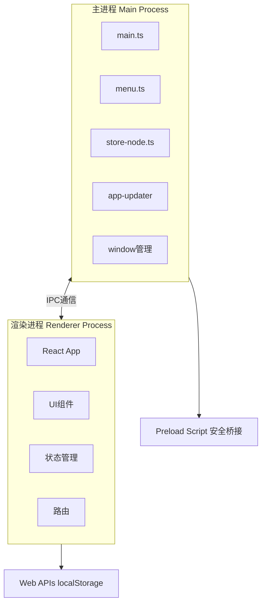

#### 主进程职责 (`src/main/`)
- **窗口管理**: 创建、销毁、状态保存
- **系统集成**: 菜单、托盘、快捷键、自动启动
- **数据持久化**: electron-store 管理配置和数据
- **自动更新**: electron-updater 处理应用更新
- **文件处理**: 文件解析（PDF、Office、EPUB等）
- **深度链接**: 处理 `chatbox://` 协议
- **知识库**: 本地数据库管理
- **MCP服务**: Model Context Protocol 实现

#### 渲染进程职责 (`src/renderer/`)
- **UI渲染**: React组件树
- **用户交互**: 事件处理、表单管理
- **状态管理**: Jotai + Zustand
- **路由导航**: TanStack Router
- **API调用**: 与LLM提供商通信

#### Preload脚本 (`src/main/preload.ts`)
- 安全地暴露主进程API到渲染进程
- 提供类型安全的IPC通信

### 2. 前端架构

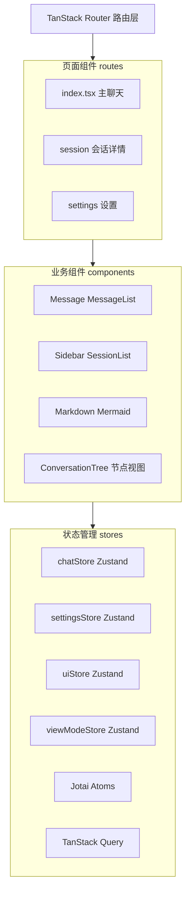

### 3. 数据模型

#### 核心实体 (`src/shared/types/`)

**Session（会话）**
```typescript
interface Session {
  id: string
  name: string
  model: string
  modelProvider: ModelProviderType
  sessionSettings: SessionSettings
  threads: SessionThread[]
  messages: Message[]
  messageForksHash: Record<string, string[]>  // 分支映射
  createdAt: number
  updatedAt: number
}
```

**Message（消息）**
```typescript
interface Message {
  id: string
  role: 'system' | 'user' | 'assistant' | 'tool'
  contentParts: MessageContentParts  // 支持多模态内容
  generating?: boolean
  cancel?: () => void
  usage?: LanguageModelUsage
}
```

**Settings（设置）**
```typescript
interface Settings {
  language: string
  theme: Theme
  fontSize: number
  // 模型配置
  // UI配置
  // 快捷键配置
  // ...
}
```

### 4. AI模型集成架构

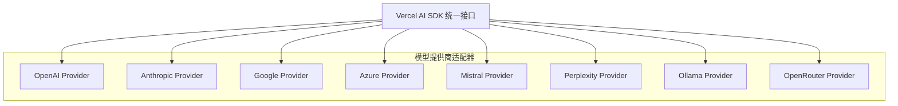

**统一模型接口**:
- 所有模型提供商通过 Vercel AI SDK 统一处理
- 支持流式和非流式响应
- 统一的错误处理和重试机制
- Token计数和使用统计

---

## 节点视图架构

### 1. 整体架构

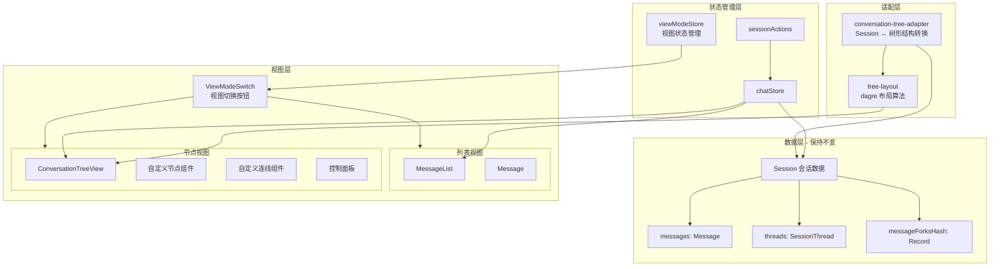

### 2. 核心数据结构

#### ViewMode 状态
```typescript
type ViewMode = 'list' | 'tree'

/** 节点位置类型 */
type NodePositions = Record<string, { x: number; y: number }>

/** 按会话ID存储的节点位置 */
type SessionNodePositions = Record<string, NodePositions>

/** 视口状态类型 */
type ViewportState = { x: number; y: number; zoom: number }

/** 按会话ID存储的视口状态 */
type SessionViewports = Record<string, ViewportState>

interface ViewModeState {
  viewMode: ViewMode                    // 当前视图模式
  selectedNodeId: string | null         // 选中的节点ID
  treeZoom: number                      // 缩放级别（兼容旧版）
  treePosition: { x: number; y: number } // 画布位置（兼容旧版）
  nodePositions: SessionNodePositions   // 按会话存储的节点位置
  sessionViewports: SessionViewports    // 按会话存储的视口状态
}
```

#### 树节点数据
```typescript
interface TreeNodeData {
  message: Message        // 原始消息
  type: 'system' | 'user' | 'assistant'
  isActivePath: boolean   // 是否在活跃路径上
  branchIndex: number     // 分支索引（0开始）
  branchCount: number     // 同级分支总数
  hasChildren: boolean    // 是否有子节点
  childrenCount: number   // 子节点数量
  depth: number           // 深度层级
}
```

#### 对话树结构
```typescript
interface ConversationTree {
  nodes: ConversationNode[]
  edges: ConversationEdge[]
  rootId: string | null        // 根节点ID
  activeLeafId: string | null  // 活跃路径叶子节点ID
  activePathIds: Set<string>   // 活跃路径节点ID集合
}
```

### 3. 数据转换流程

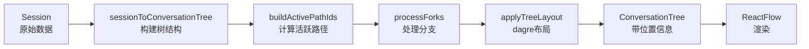

### 4. 节点组件设计

| 节点类型 | 组件 | 颜色主题 | 特殊功能 |
|---------|------|---------|---------|
| SystemNode | `SystemNode.tsx` | 灰色虚线边框 | 显示系统提示预览 |
| UserNode | `UserNode.tsx` | 蓝色 | 附件数量、分支指示器 |
| AssistantNode | `AssistantNode.tsx` | 绿色 | 模型名、token用量、生成状态、分支指示器 |

**共同特性**：
- 活跃路径节点有 `ring` 高亮效果
- 非活跃路径节点 `opacity-60` 半透明
- 分支节点使用 8 色调色板区分
- 使用 `Handle` 组件提供连接点

### 5. 边组件设计

| 边类型 | 组件 | 样式 | 用途 |
|-------|------|------|------|
| ActivePathEdge | `ActivePathEdge.tsx` | 绿色实线 + 发光 + 流动动画 | 当前活跃对话路径 |
| BranchEdge | `BranchEdge.tsx` | 彩色虚线 (根据 branchIndex) | 非活跃分支 |
| DefaultEdge | `DefaultEdge.tsx` | 灰色实线 | 普通连线 |

### 6. 布局配置

```typescript
const DEFAULT_OPTIONS = {
  nodeWidth: 280,
  nodeHeight: 120,
  horizontalSpacing: 50,
  verticalSpacing: 80,
  direction: 'TB',  // 从上到下
}
```

### 7. 状态持久化机制

节点视图实现了完整的状态持久化，确保用户在切换视图或刷新页面后能恢复之前的状态：

#### 持久化内容
| 状态类型 | 存储位置 | 说明 |
|---------|---------|------|
| 节点位置 | `nodePositions[sessionId]` | 每个节点的 x, y 坐标 |
| 视口状态 | `sessionViewports[sessionId]` | 画布的平移和缩放状态 |
| 视图模式 | `viewMode` | 列表/树形视图切换状态 |

#### 持久化流程
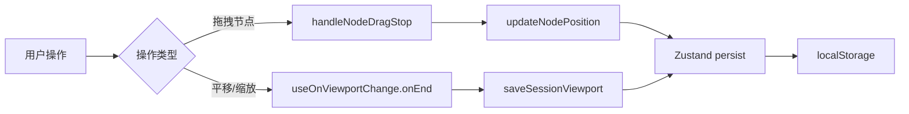

#### 恢复流程
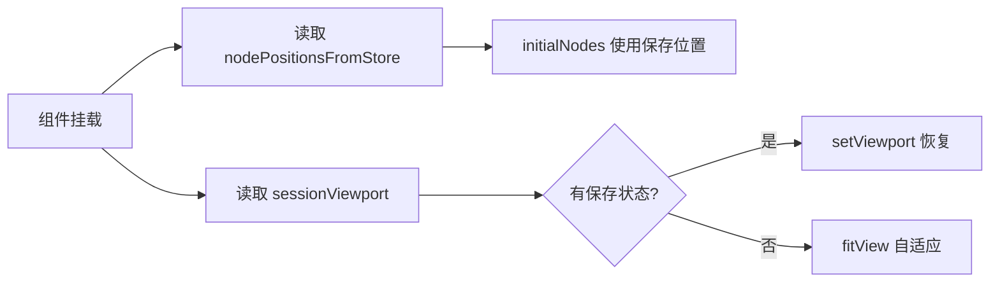

### 8. 交互组件架构

节点视图提供了丰富的交互组件：

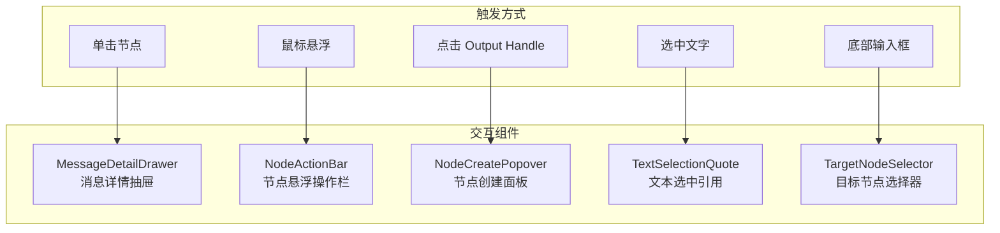

#### 组件功能说明

| 组件 | 文件 | 功能 |
|-----|------|------|
| MessageDetailDrawer | `MessageDetailDrawer.tsx` | 右侧抽屉显示完整消息内容，支持 Markdown 渲染 |
| NodeActionBar | `NodeActionBar.tsx` | 悬浮操作栏：编辑、复制、引用、删除、重新生成、切换分支 |
| NodeCreatePopover | `NodeCreatePopover.tsx` | 就地创建 User/Assistant 节点，支持简易输入 |
| TextSelectionQuote | `TextSelectionQuote.tsx` | 选中文字后显示引用按钮，创建带引用的新消息 |
| TargetNodeSelector | `TargetNodeSelector.tsx` | 底部输入框增强，可指定消息插入位置 |

### 9. 分支颜色方案

8种预定义颜色循环使用：
- amber, violet, pink, cyan, orange, purple, teal, red

每种颜色包含：`{ bg, border, text }` 三个属性

---

## 数据流与状态管理

### 状态管理策略

项目采用**分层状态管理**策略，不同类型的状态使用不同的工具：

#### 1. Zustand - 全局应用状态
```typescript
// src/renderer/stores/chatStore.ts
export const useChatStore = create<ChatStore>((set) => ({
  sessions: [],
  currentSessionId: null,
  // ...
}))

// src/renderer/stores/viewModeStore.ts
export const useViewModeStore = create<ViewModeState>()(
  persist(
    (set, get) => ({
      viewMode: 'list',
      selectedNodeId: null,
      treeZoom: 1,
      treePosition: { x: 0, y: 0 },
      nodePositions: {},
      sessionViewports: {},
      // actions...
    }),
    {
      name: 'view-mode-store',
      version: 3,
      partialize: (state) => ({
        viewMode: state.viewMode,
        nodePositions: state.nodePositions,
        sessionViewports: state.sessionViewports,
      }),
    }
  )
)
```

**管理内容**:
- 会话列表 (sessions)
- 当前会话 (currentSessionId)
- 消息数据
- 设置配置
- 视图模式 (viewMode)
- 节点位置 (nodePositions)
- 视口状态 (sessionViewports)

#### 2. Jotai - 原子化UI状态
```typescript
// src/renderer/stores/atoms/
export const messageInputAtom = atom('')
export const isGeneratingAtom = atom(false)
```

**管理内容**:
- 输入框状态
- 加载状态
- 临时UI状态

#### 3. TanStack Query - 服务端状态
```typescript
const { data, isLoading } = useQuery({
  queryKey: ['models'],
  queryFn: fetchModels
})
```

**管理内容**:
- API请求缓存
- 自动重试
- 后台数据同步

### 数据持久化

#### 桌面端（Electron）
```
electron-store (主进程)
├─ config.json           # 应用配置
├─ sessions/             # 会话数据
├─ settings.json         # 用户设置
└─ blob/                 # 二进制数据（图片等）
```

#### Web端/移动端
```
IndexedDB (localforage)
├─ sessions              # 会话存储
├─ settings              # 设置存储
└─ files                 # 文件存储
```

### 消息流处理

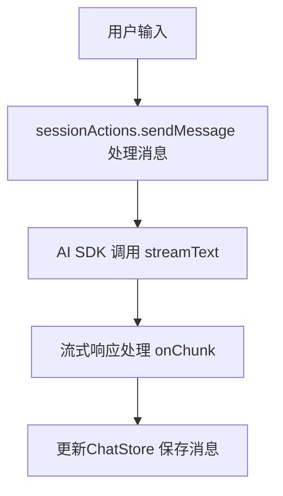

### 视图切换数据流

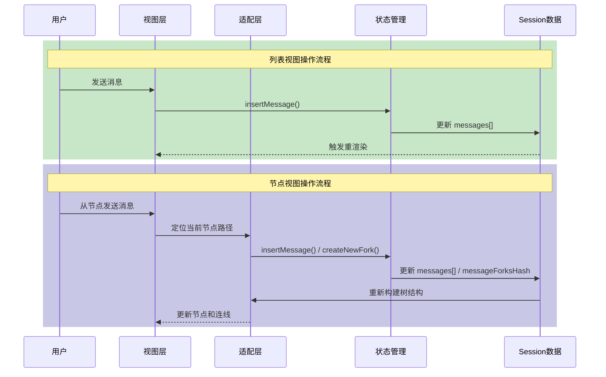

### 节点位置计算流程

新节点创建时的位置计算：

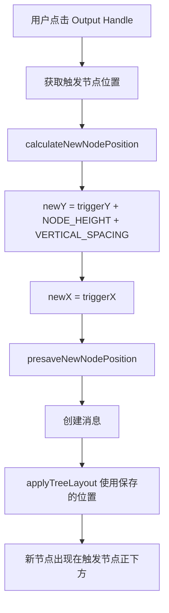

---

## 多平台支持

### 平台抽象层 (`src/renderer/platform/`)

项目通过平台抽象层实现"一次编写，多处运行"：

```typescript
// platform/index.ts
const platform = {
  type: 'electron' | 'web' | 'mobile',
  isMac: boolean,
  isWindows: boolean,
  // 平台特定API
}
```

### 构建目标

#### 1. 桌面端（Electron）
```bash
npm run dev              # 开发模式
npm run build            # 构建
npm run package          # 打包当前平台
npm run package:all      # 打包所有平台
```

**打包输出**:
- Windows: `.exe` (NSIS安装包)
- macOS: `.dmg` (Intel + Apple Silicon)
- Linux: `.AppImage`, `.deb`

#### 2. Web端
```bash
npm run dev:web          # Web开发模式
npm run build:web        # Web构建
npm run serve:web        # 预览Web版本
```

**特点**:
- 纯前端应用
- 使用浏览器存储API
- 受浏览器安全限制

#### 3. 移动端（Capacitor）
```bash
npm run mobile:sync:ios      # 同步iOS
npm run mobile:sync:android  # 同步Android
npm run mobile:ios           # 打开iOS项目
npm run mobile:android       # 打开Android项目
```

**特点**:
- 使用Capacitor桥接原生功能
- 原生UI外壳 + Web内容
- 支持原生插件

### 平台差异处理

```typescript
// 条件编译
if (platform.type === 'electron') {
  // 使用Electron API
  await window.electron.openFile()
} else if (platform.type === 'mobile') {
  // 使用Capacitor API
  await Filesystem.readFile(...)
} else {
  // 使用Web API
  const file = await input.files[0]
}
```

### 节点视图平台适配

- **桌面端**：完整节点视图功能
- **Web端**：完整节点视图功能
- **移动端**：默认使用列表视图（触摸交互优化）

---

## 构建与部署

### 开发环境

```bash
# 1. 安装依赖
npm install

# 2. 启动开发服务器
npm run dev          # Electron开发模式
npm run dev:web      # Web开发模式

# 3. 运行测试
npm run test         # 运行测试
npm run test:watch   # 监听模式
npm run test:ui      # UI测试界面
```

### 构建配置

#### Webpack配置
- `.erb/configs/webpack.config.main.prod.ts` - 主进程生产构建
- `.erb/configs/webpack.config.renderer.dev.ts` - 渲染进程开发
- `.erb/configs/webpack.config.renderer.prod.ts` - 渲染进程生产

#### Electron Builder配置
- `electron-builder.yml` - 打包配置
- 支持代码签名、公证、自动更新

### 发布流程

```bash
# 1. 构建所有平台
npm run package:all

# 2. 发布到特定平台
npm run release:win      # Windows
npm run release:mac      # macOS
npm run release:linux    # Linux
npm run release:web      # Web

# 3. 发布到应用商店（需配置）
npm run electron:publish-win
npm run electron:publish-mac
npm run electron:publish-linux
```

### CI/CD
- 使用GitHub Actions
- 自动构建和发布
- 多平台并行构建

---

## 扩展开发指南

### 1. 添加新的AI模型提供商

#### 步骤1: 安装SDK
```bash
npm install @ai-sdk/your-provider
```

#### 步骤2: 定义模型类型
```typescript
// src/shared/types.ts
export enum ModelProviderEnum {
  // ...
  YourProvider = 'your-provider',
}
```

#### 步骤3: 创建适配器
```typescript
// src/renderer/adapters/your-provider.ts
import { createYourProvider } from '@ai-sdk/your-provider'

export function createProvider(config: Config) {
  return createYourProvider({
    apiKey: config.yourProviderApiKey,
  })
}
```

#### 步骤4: 集成到会话操作
```typescript
// src/renderer/stores/sessionActions.ts
case ModelProviderEnum.YourProvider:
  provider = createYourProvider(config)
  break
```

### 2. 添加新的节点类型

#### 步骤1: 创建节点组件
```typescript
// src/renderer/components/conversation-tree/nodes/YourNode.tsx
import { Handle, Position, type NodeProps } from '@xyflow/react'
import type { TreeNodeData } from '@/lib/conversation-tree-adapter'

export function YourNode({ data }: NodeProps<TreeNodeData>) {
  return (
    <div className="your-node-styles">
      <Handle type="target" position={Position.Top} />
      {/* 节点内容 */}
      <Handle type="source" position={Position.Bottom} />
    </div>
  )
}
```

#### 步骤2: 注册节点类型
```typescript
// src/renderer/components/conversation-tree/nodes/index.ts
export const nodeTypes = {
  system: SystemNode,
  user: UserNode,
  assistant: AssistantNode,
  your: YourNode,  // 新增
}
```

### 3. 添加新的边类型

#### 步骤1: 创建边组件
```typescript
// src/renderer/components/conversation-tree/edges/YourEdge.tsx
import { BaseEdge, getSmoothStepPath, type EdgeProps } from '@xyflow/react'

export function YourEdge(props: EdgeProps) {
  const [edgePath] = getSmoothStepPath(props)
  return <BaseEdge path={edgePath} style={{ stroke: '#your-color' }} />
}
```

#### 步骤2: 注册边类型
```typescript
// src/renderer/components/conversation-tree/edges/index.ts
export const edgeTypes = {
  activePath: ActivePathEdge,
  branch: BranchEdge,
  default: DefaultEdge,
  your: YourEdge,  // 新增
}
```

### 4. 添加新的交互组件

节点视图的交互组件遵循统一的模式：

```typescript
// src/renderer/components/conversation-tree/YourInteraction.tsx
import { useViewModeStore } from '@/stores/viewModeStore'

interface YourInteractionProps {
  session: Session
  nodeId: string
  onAction: () => void
}

export function YourInteraction({ session, nodeId, onAction }: YourInteractionProps) {
  const selectedNodeId = useViewModeStore((s) => s.selectedNodeId)
  
  // 实现交互逻辑
  return (
    <div className="your-interaction">
      {/* 交互UI */}
    </div>
  )
}
```

### 5. 国际化

#### 添加翻译
```typescript
// src/renderer/i18n/locales/en/translation.json
{
  "conversation-tree": {
    "list-view": "List View",
    "tree-view": "Tree View",
    "create-user-node": "New User Message",
    "create-assistant-node": "Generate AI Response",
    "switch-branch": "Switch to this branch"
  }
}

// src/renderer/i18n/locales/zh-Hans/translation.json
{
  "conversation-tree": {
    "list-view": "列表视图",
    "tree-view": "节点视图",
    "create-user-node": "新建用户消息",
    "create-assistant-node": "生成 AI 回复",
    "switch-branch": "切换到此分支"
  }
}
```

#### 使用翻译
```typescript
import { useTranslation } from 'react-i18next'

function YourComponent() {
  const { t } = useTranslation()
  return <h1>{t('conversation-tree.tree-view')}</h1>
}
```

### 6. 样式开发

#### Tailwind CSS类
```tsx
<div className="flex items-center gap-2 px-4 py-2 rounded-lg bg-gray-100">
  {/* ... */}
</div>
```

#### Mantine组件
```tsx
import { Button, TextInput } from '@mantine/core'

<TextInput
  label="Label"
  placeholder="Placeholder"
/>
<Button variant="filled">Click</Button>
```

### 7. 测试

```typescript
// src/renderer/lib/__tests__/conversation-tree-adapter.test.ts
import { describe, it, expect } from 'vitest'
import { sessionToConversationTree } from '../conversation-tree-adapter'

describe('ConversationTreeAdapter', () => {
  it('should convert session to tree', () => {
    const session = createMockSession()
    const tree = sessionToConversationTree(session)
    expect(tree.nodes.length).toBeGreaterThan(0)
  })
})
```

运行测试:
```bash
npm run test              # 运行所有测试
npm run test:watch        # 监听模式
npm run test:coverage     # 生成覆盖率报告
```

---

## 关键技术点

### 1. MCP（Model Context Protocol）集成
- 位置: `src/main/mcp/`
- 支持与MCP服务器通信
- 扩展LLM能力

### 2. 知识库功能
- 位置: `src/main/knowledge-base/`
- 使用libsql数据库
- 支持向量检索
- RAG（检索增强生成）

### 3. 文件解析
- 位置: `src/main/file-parser.ts`
- 支持格式: PDF, DOCX, XLSX, EPUB, TXT, Markdown等
- 自动提取文本内容

### 4. 节点视图
- 位置: `src/renderer/components/conversation-tree/`
- 使用 ReactFlow (@xyflow/react) 渲染
- 使用 dagre 进行自动布局
- 支持分支可视化和交互
- 状态持久化到 localStorage（节点位置、视口状态）
- 丰富的交互组件（详情抽屉、操作栏、创建面板等）

### 5. 自动更新
- 使用electron-updater
- 支持增量更新
- 配置在`electron-builder.yml`

### 6. 代码保护
- 使用webpack-obfuscator
- 生产环境代码混淆
- 保护敏感逻辑

### 7. 错误追踪
- 集成Sentry
- 自动捕获崩溃和错误
- 开发/生产环境隔离

### 8. 性能监控
- Web Vitals集成
- 性能指标收集
- Google Analytics集成

---

## 开发规范

### 代码风格
- 使用Biome进行代码格式化和Lint
- 配置文件: `biome.json`
- 运行: `npm run lint` / `npm run format`

### Git工作流
- 使用Husky管理Git Hooks
- Commit前自动格式化: `lint-staged`
- 分支保护

### TypeScript
- 严格模式启用
- 路径别名: `@/*` -> `src/renderer/*`
- 所有新代码必须有类型定义

### 组件规范
- 使用函数组件 + Hooks
- Props需要TypeScript接口定义
- 复杂组件拆分为子组件

---

## 常见问题

### Q: 如何切换列表视图和节点视图？
**A:** 点击顶部 Header 中的视图切换按钮（列表图标/节点图标）。

### Q: 节点视图支持哪些交互？
**A:** 
- 单击节点：打开右侧消息详情抽屉
- 双击节点：编辑消息内容
- 鼠标悬浮：显示底部操作栏（编辑、复制、引用、删除、重新生成）
- 点击 Output Handle：弹出创建面板，可创建 User/Assistant 节点
- 选中文字：显示引用按钮
- 拖拽节点：调整节点位置（自动保存）
- 拖拽画布：平移视图
- 滚轮：缩放视图
- 小地图：快速导航

### Q: 节点位置会保存吗？
**A:** 是的，节点位置和视口状态都会自动保存到 localStorage，切换视图或刷新页面后会自动恢复。

### Q: 如何在节点视图中创建分支？
**A:** 点击任意节点底部的 Output Handle（圆点），在弹出的面板中选择创建 User 消息或 AI 回复。从非叶子节点创建会自动产生新分支。

### Q: 如何切换到其他分支？
**A:** 鼠标悬浮在非当前分支的节点上，点击操作栏中的"切换分支"按钮。

### Q: 如何添加新的快捷键？
**A:** 在`src/main/main.ts`中注册全局快捷键，在`src/renderer/routes/settings/hotkeys.tsx`中添加设置项。

### Q: 如何调试主进程代码？
**A:** 运行`npm run dev:debug`，然后在Chrome中打开`chrome://inspect`，连接到`localhost:5858`。

### Q: 数据存储在哪里？
**A:** 
- Electron: `~/.config/Chatbox` (Linux), `~/Library/Application Support/Chatbox` (Mac), `%APPDATA%\Chatbox` (Windows)
- Web: IndexedDB
- Mobile: 原生存储

---

## 参考资源

### 官方文档
- [Electron文档](https://www.electronjs.org/docs)
- [React文档](https://react.dev/)
- [TanStack Router](https://tanstack.com/router)
- [Mantine UI](https://mantine.dev/)
- [Vercel AI SDK](https://sdk.vercel.ai/)
- [ReactFlow文档](https://reactflow.dev/)
- [dagre布局算法](https://github.com/dagrejs/dagre)

### 项目文档
- [FAQ](./doc/FAQ.md)
- [错误处理](./ERROR_HANDLING.md)
- [团队共享](./team-sharing/README.md)
- [开发计划](./开发计划.md)

---

## 总结

Chatbox V1 是一个架构清晰、模块化良好的现代化AI客户端项目。其核心特点：

✅ **分层架构**: 主进程/渲染进程分离，职责明确
✅ **多平台支持**: 一套代码，多端运行
✅ **现代技术栈**: React 18 + TypeScript + 最新工具链
✅ **可扩展性强**: 插件化设计，易于添加新功能
✅ **代码质量高**: 类型安全、测试覆盖、代码规范
✅ **节点视图**: Git 风格的对话分支可视化，支持状态持久化和丰富交互

适合进行二次开发和功能扩展。建议从小功能入手，熟悉项目结构后再进行大型改动。

---

**文档版本**: 1.2  
**更新日期**: 2025-12-20  
**项目版本**: 0.0.1  
**节点视图功能**: 阶段一~三已完成（基础设施、核心视图、交互功能）
